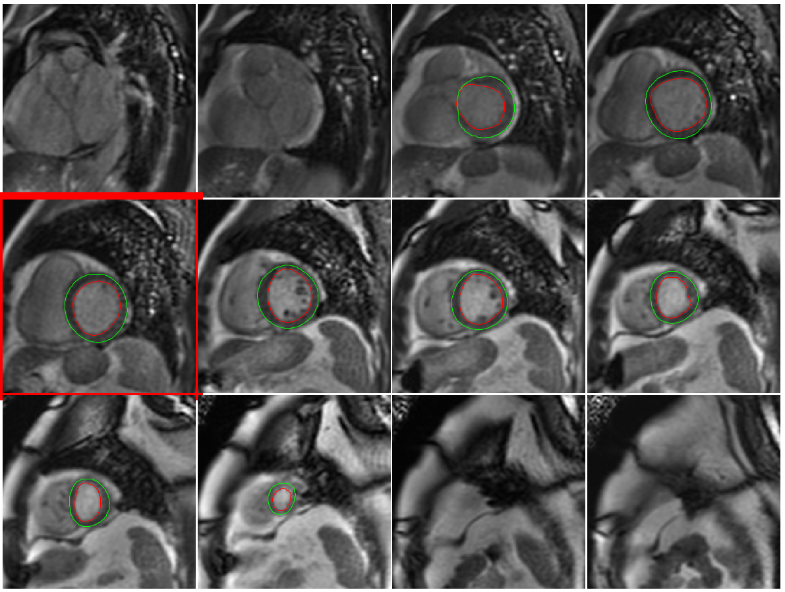

# cmr_cine

This is the repo for a system to segmenation myocardium from free-breathing or breath-hold cardiac MR cine imaging using deep learning. It is developed by:

```
Hui Xue
National Heart Lung and Blood Institute (NHLBI)
National Institutes of Health
Building 10, B1D416
10 Center Drive, MSC-1061
Bethesda, MD 20892-1061
USA

Email: hui.xue@nih.gov
Phone: 301-827-0156
```



This project is for my course study at Stanford CS department, CS229, Spring 2019. 
